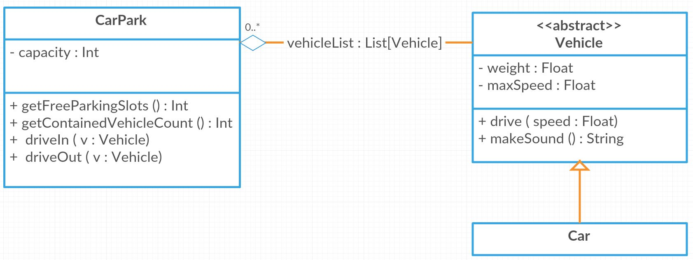

# scalaBasics

This is a project for learning some basics of the object oriented parts of Scala. Maven is used for dependencies and build. There are unit tests (Scalatest) which you can use to implement this project -> Test Driven Development.

1. The following object oriented structure is given. The abstract class `Vehicle` represents everything that can drive. Vehicles have a weight and a maximum speed. They can drive and make a sound. `Car` is a concrete implementation of `Vehicle`. The `CarPark` has a defined capacity, allows cars to drive in and out and contains therefore an aggregation onto `Vehicle`.

2. Execute the tests in [/src/test/scala/de.scala.basics/](https://github.com/philenius/scalaBasics/tree/master/src/test/scala/de/scala/basics)
3. Make the tests green by implementing the missing code.
4. Congratulations! :+1:
